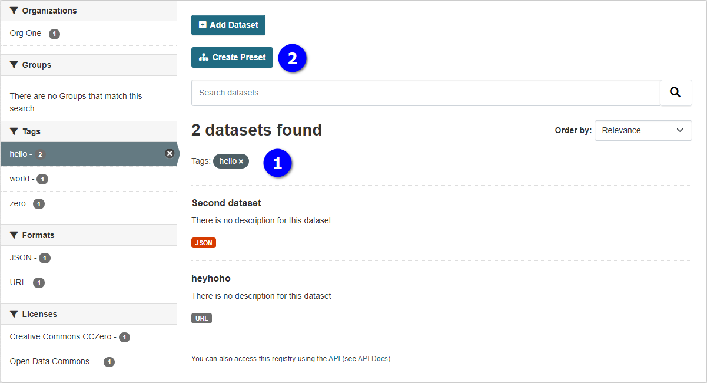
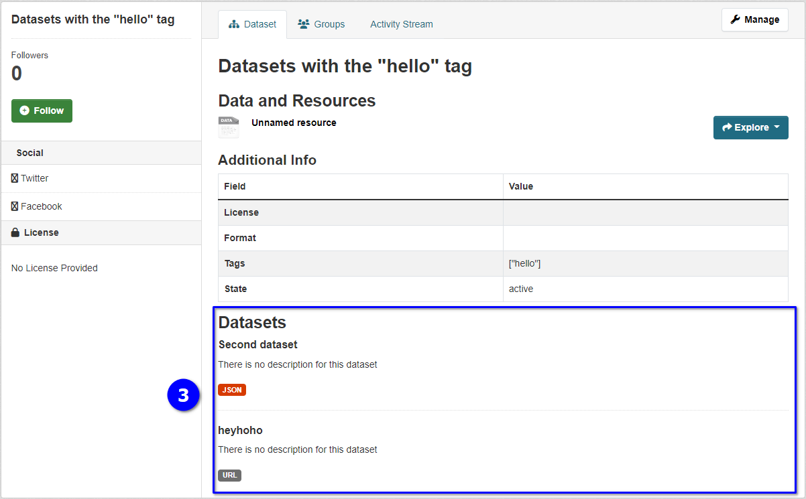

[](https://github.com/DataShades/ckanext-search-preset/actions)

# ckanext-search-preset

Plugin that adds a number of API actions/helpers for storing search facets as a package fields and listing all the datasets that satisfies stored facets.

One of examples, where you can use this extension:

- you need a dataset that "contains" a lot of other datasets. Let's call this
dataset a **collection**
- these "other" datasets can be described by the fixed set of search facets. For
example: all the _public_ datasets with at least one _CSV resource_ and _CC-BY_
license.
- you want to select all the necessary facets on the search page❶, and
trigger **collection** creation from there❷(right after seeing all the target
datasets, that are going to be included into the **collection**)
- When collection is created, you want to see all the datasets that satisfies
given facets on the collection page❸. In future, all the new datasets that
satisfy given facets, should be added automatically to the collection page.




On the screenshots above you can observe default behavior of this plugin. Of course, these widgets require proper styling. Just use them as starting point(source code is available inside `ckanext/search-preset/templates` folder of the current extension) and customize for your needs.

## Content

- [Requirements](#requirements)
- [Installation](#installation)
- [Preset requirements](#preset-requirements)
- [Developer installation](#developer-installation)
- [Tests](#tests)

## Requirements

This extension requires Python v3.7 or newer.

Compatibility with core CKAN versions:

| CKAN version | Compatible? |
| ------------ | ----------- |
| 2.9          | yes         |
| 2.10         | yes         |

## Installation

To install ckanext-search-preset:

1. Install the extension via pip

   ```sh
   pip install ckanext-search-preset
   ```

1. Add `search-preset` to the `ckan.plugins` setting in your CKAN
   config file.

1. Create custom package type that will serve a role of preset(collection).
   [Here](#preset-requirements) you can find more details about requirements for
   this package type.

## Config settings

```ini
# Default preset type created by "Create Preset" button on the search page
ckanext.search_preset.default_type = preset

# List of preset types that should show matching packages(❷) on their details
# page
# (optional, default: <value of default_type option>).
ckanext.search_preset.package_types = preset collection dataset

# Field that is used for grouping the packages before printing them on the
# preset page
# (optional, default: none).
ckanext.search_preset.group_by_field = type

# Prefix of the preset fields that will hold details about active facets
# (optional, default: "search_preset_field_").
ckanext.search_preset.field_prefix = facet_field_

# List of facets that can be used by preset. By default, any existing facet is
# allowed.
# (optional, default: <any existing facet>).
ckanext.search_preset.allowed_facets = license_id organization

# Preset field that holds all the `ext_*` fields that were available during
# preset creation via ❶
# (optional, default: none).
ckanext.search_preset.extras_field = search_extra_field_

# List of `ext_*` that will be captured by preset if `extras_field` specified.
# By default, all the `ext_*` fields are captured.
# (optional, default: <any passed extra field>).
ckanext.search_preset.allowed_extras = ext_bbox ext_start_date
```

## Preset requirements

In order to function properly, this extension requires a special "preset"
package type. One can register one *default* preset type(which will be used by
existing widgets) using `ckanext.search_preset.default_type` config option and
arbitrary number of additional preset types using
`ckanext.search_preset.package_types` config option.

If no default type configured, create-preset button on the search page(❷) will
not be shown, but you still can create search presets programmatically.

If neither default, nor additional types configured, datasets won't be shown on
the preset page(❸). Because there is no way to tell, which package type is a
"preset" type, obviously.

Whenever you are creating a preset using ❷, all the active facets will be stored
inside custom fields of the preset package. You have to define these fields in
advance, by customizing package schema. The plugin will make an atempt to save
the value of facet inside a filed named as `<PREFIX><FACET_NAME>`. Default
prefix is `search_preset_field_` and it can be changed using
`ckanext.search_preset.field_prefix` config option. So, in order to store
`license_id` facet, with default prefix, you have to define a field named
`search_preset_field_license_id`.

Example of a schema for `ckanext-schema` with a definition of preset, that keeps
values of `license_id`, `res_format` and `tags` facets, can be found at
[`ckanext/search-preset/example_preset.yaml`](ckanext/search-preset/example_preset.yaml).

All the active facets are stored as JSON encoded arrays of values. It means that
you can avoid using ❷ and create preset using `ckanapi`, for example:

```sh
ckanapi action package_create \
    name=datasets-with-tag-xxx \
    type=<preset-type> \
    search_preset_field_tags='["xxx"]'
```

You can start from the example schema of preset and adapt it for your needs. For
example, you can replace plain input fields with hidden fields.

Whenever user visits the preset details page, the list of datasets that matches preset's filters, will be shown at the bottom of the page. You can rewrite the Jinja2 block and snippet that reponsible for this output(❸).

In addition, the list of preset's packages can be obtained via `ckanapi`:

```sh
ckanapi action search_preset_preset_list id=<preset-id-or-name>
```

## Developer installation

To install ckanext-search-preset for development, activate your CKAN virtualenv and
do:

    git clone https://github.com/DataShades/ckanext-search-preset.git
    cd ckanext-search-preset
    pip install -e '.[dev]'

## Tests

To run the tests, do:

    pytest --ckan-ini=test.ini

## License

[AGPL](https://www.gnu.org/licenses/agpl-3.0.en.html)
